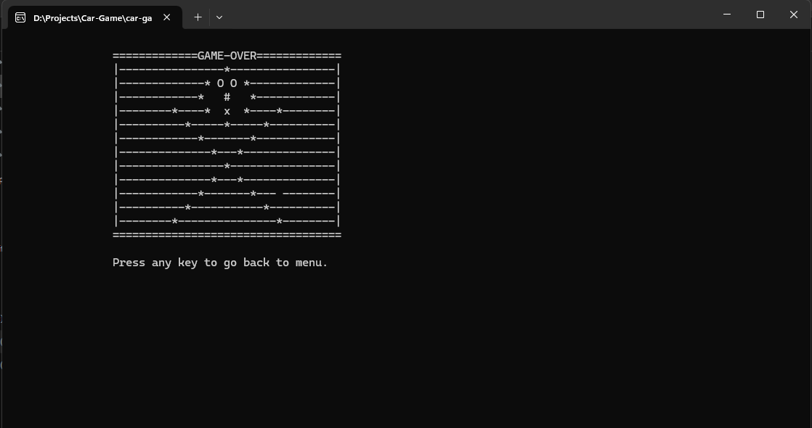

After studying Object Oriented Programming(OOP) i was able to make this project. 
# Car Game (C++ Console)

A simple **console-based car game** built in **C++** for Windows.  
Avoid enemy cars, score points, and try to reach 100 to win.

---

## Features
- Multiple levels with increasing speed
- Collision detection and game over screen
- High score saving in `score.txt`
- Victory condition at 100 points
- Sound effects for crash, game over, and win

---

## Controls
| Key | Action     |
|-----|-----------|
| W   | Move Up   |
| S   | Move Down |
| A   | Move Left |
| D   | Move Right |
| ESC | Exit Game |

---

## Installation
1. Compile the code:
   ```bash
   g++ main.cpp -o car-game -lwinmm
   ```
2. Run the game:
    ```
    ./car-game
    ```


## Screenshots
1. Main Menu 


2. Gameplay


3. Game Over


4. Victory


5. Instructions


## click here for [Demo video](https://drive.google.com/file/d/1U6egzYmDUhzkIy3BKQi9m18DRBr0HxLY/view?usp=sharing)